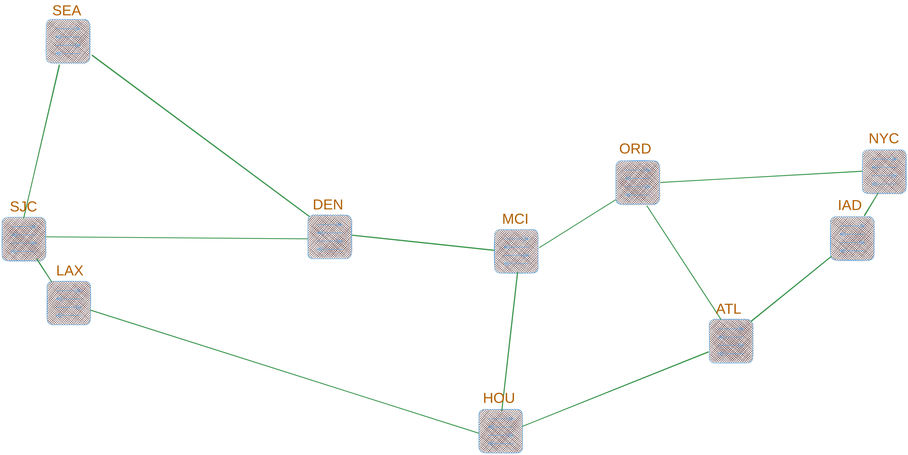
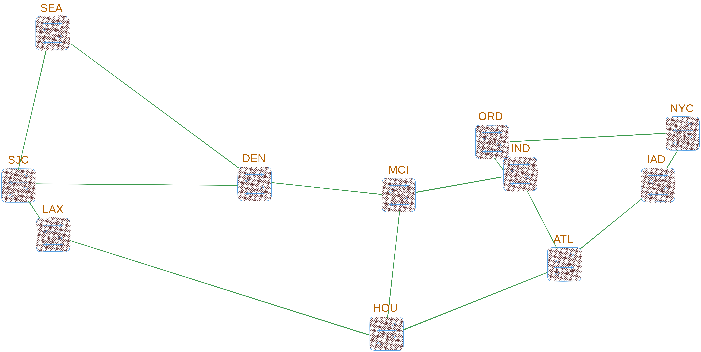

# Hierarchical-SDN-Controllers

## Topologies

### AbileneMod



 * consists of 10 switches

### Abilene



 * consists of 11 switches

## Traffic generators
- [ixia-c](https://github.com/open-traffic-generator/ixia-c#quick-start)
- [D-ITG](https://traffic.comics.unina.it/software/ITG/download.php)

## Running basic scenario

For simple test run - on Mininet VM please run:

> in one terminal
```
ryu-manager ryu.app.simple_switch_stp_13 --log-file /tmp/ryu-logs.$$.log &>/dev/null
tail -f /tmp/ryu-logs.$$.log
```

> in second run
```
sudo mn -c &>/dev/null
sudo ./src/simple_run.py
```

## Running traffic generation scripts

```
scripts/generate_flows.sh
```
This script generate unique flows with hard-coded parameters that can be changed freely.

```
scripts/generate_traffic.sh
```
Generates flows based on `generate_flows.sh` script. In order to add more flows, add new lines with desired flow parameters.

```
scripts/start_traffic.sh
```
Starts the traffic generation process (sender part) on the hosts that are configured to be senders. In order for the traffic to be recieved
you have to start recievers on hosts that shall receive the traffic (`./ITGRecv &`).
